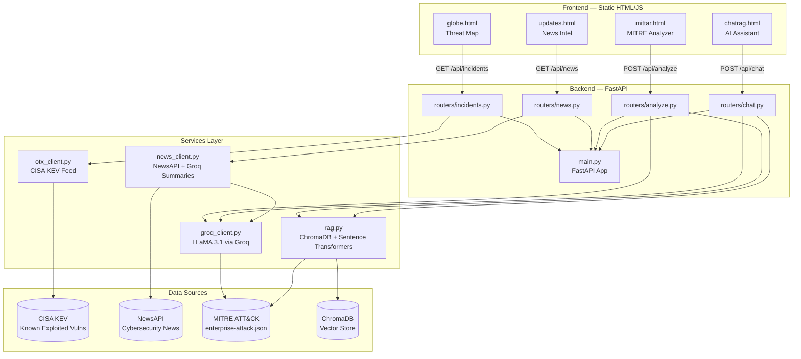
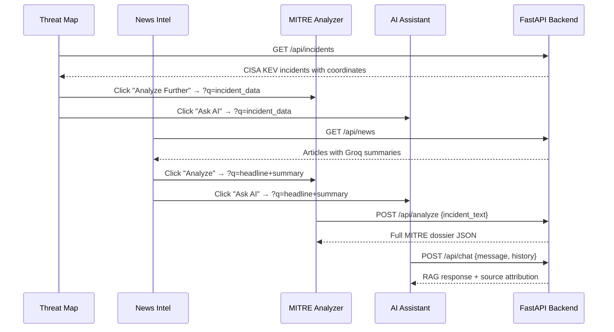

# OCULUS — Cyber Intelligence Platform

> Real-time critical infrastructure threat monitoring, MITRE ATT&CK analysis, and AI-powered threat intelligence — built for security analysts.


---

## What is OCULUS?

OCULUS is a full-stack cyber threat intelligence platform purpose-built for critical infrastructure security. It aggregates live vulnerability and incident data, maps threats to the MITRE ATT&CK framework using RAG (Retrieval-Augmented Generation), and surfaces actionable intelligence through four interconnected interfaces — a 3D globe, a news feed, a threat analyzer, and an AI assistant.

---

## Architecture



---

## Features

### Threat Map (`globe.html`)
- Full-screen interactive 3D globe powered by Globe.GL and Three.js
- Live incident markers pulled from CISA Known Exploited Vulnerabilities feed
- Color-coded threat levels: Critical (red), Medium (amber), Low (green)
- Animated arcs connecting high-severity incidents
- Click any incident to open a detail panel with direct links to Analyzer and AI Assistant
- Sector filters: Aviation, Power Grid, OT/ICS, Maritime
- Auto-rotating globe with smooth scroll-triggered entrance animation

### News Intel (`updates.html`)
- Live cybersecurity news cards from NewsAPI across ICS/SCADA/OT queries
- Each article AI-summarized by LLaMA 3.1 via Groq in real time
- Scrolling ticker with threat level badges
- One-click redirect to Analyzer or AI Assistant with article context pre-loaded

### MITRE ATT&CK Analyzer (`mittar.html`)
- Paste any incident report, CVE description, or raw threat intel
- Groq first expands brief inputs into full technical narratives
- RAG pipeline retrieves relevant MITRE ATT&CK techniques via semantic similarity
- LLaMA 3.1 generates a full intelligence dossier:
  - Threat severity, confidence, sector, threat actor
  - Step-by-step attack timeline
  - MITRE technique mappings (T-IDs with tactic pills)
  - Indicators of Compromise (IPs, domains, hashes, CVEs)
  - Mitigation strategy cards
- Auto-triggered when redirected from Globe or News Intel

### AI Assistant (`chatrag.html`)
- Conversational cybersecurity analyst powered by LLaMA 3.1
- RAG-backed: every query retrieves relevant MITRE ATT&CK knowledge chunks from ChromaDB
- Full conversation history maintained within session
- Source attribution pills showing which KB entries informed the response
- Auto-triggered with incident context when redirected from other pages

---

## Tech Stack

| Layer | Technology |
|---|---|
| Backend Framework | FastAPI + Uvicorn |
| LLM | LLaMA 3.1 8B Instant via Groq API |
| Vector Database | ChromaDB (persistent local) |
| Embeddings | sentence-transformers/all-MiniLM-L6-v2 |
| Knowledge Base | MITRE ATT&CK Enterprise (709 techniques) |
| Threat Intel | CISA Known Exploited Vulnerabilities feed |
| News | NewsAPI |
| 3D Globe | Globe.GL + Three.js |
| Animations | GSAP + ScrollTrigger |
| Frontend | Vanilla HTML/CSS/JS |
| Fonts | Alfa Slab One, Stardos Stencil, PT Serif Caption |

---

## Project Structure

```
oculus/
├── main.py                     # FastAPI app, CORS, router registration
├── .env                        # API keys (not committed)
├── requirements.txt
│
├── routers/
│   ├── incidents.py            # GET /api/incidents — CISA KEV data
│   ├── news.py                 # GET /api/news — NewsAPI + Groq summaries
│   ├── analyze.py              # POST /api/analyze — MITRE ATT&CK dossier
│   └── chat.py                 # POST /api/chat — RAG conversational AI
│
├── services/
│   ├── otx_client.py           # CISA KEV fetcher, country coordinate mapping
│   ├── news_client.py          # NewsAPI fetcher, Groq summarization
│   ├── groq_client.py          # expand_incident + analyze_incident via LLaMA
│   └── rag.py                  # ChromaDB ingestion, MITRE loading, retrieval
│
├── data/
│   └── mitre_attack.json       # MITRE ATT&CK Enterprise JSON (not committed)
│
├── chroma_db/                  # Persistent ChromaDB vector store (not committed)
│
└── static/
    ├── globe.html              # Threat Map
    ├── updates.html            # News Intel
    ├── mittar.html             # MITRE Analyzer
    ├── chatrag.html            # AI Assistant
    └── oculus-logo.svg         # Brand logo
```

---

## Setup

### Prerequisites
- Python 3.10+
- Node not required — all frontend is vanilla HTML

### 1. Clone the repository

```bash
git clone https://github.com/purrieie/oculus.git
cd oculus
```

### 2. Create virtual environment

```bash
python -m venv venv
source venv/bin/activate        # Mac/Linux
venv\Scripts\activate           # Windows
```

### 3. Install dependencies

```bash
pip install fastapi uvicorn python-dotenv groq chromadb sentence-transformers requests newsapi-python
```

Note: `sentence-transformers` pulls in PyTorch — expect a 2-3 minute install.

### 4. Get API keys

| Service | URL | Free Tier |
|---|---|---|
| Groq | console.groq.com | Yes |
| NewsAPI | newsapi.org | Yes |
| CISA KEV | No key required | Public |

### 5. Configure environment

Create `.env` in the project root:

```
GROQ_API_KEY=gsk_...
NEWS_API_KEY=...
```

### 6. Download MITRE ATT&CK data

```bash
curl -L "https://raw.githubusercontent.com/mitre/cti/master/enterprise-attack/enterprise-attack.json" -o data/mitre_attack.json
```

This is ~50MB. The RAG pipeline will auto-ingest it into ChromaDB on first run.

### 7. Run the server

```bash
uvicorn main:app --reload --port 8000
```

### 8. Open in browser

| Page | URL |
|---|---|
| Threat Map | http://localhost:8000/static/globe.html |
| News Intel | http://localhost:8000/static/updates.html |
| MITRE Analyzer | http://localhost:8000/static/mittar.html |
| AI Assistant | http://localhost:8000/static/chatrag.html |
| API Docs | http://localhost:8000/docs |

---

## API Reference

### `GET /api/incidents`
Returns live incidents from CISA KEV with coordinates and threat classification.

```json
[
  {
    "id": "CVE-2026-11645",
    "title": "CVE-2026-11645 — Google Chromium V8",
    "sector": "General",
    "lat": 37.1,
    "lon": -95.7,
    "threat": "high",
    "date": "2026-06-09",
    "summary": "..."
  }
]
```

### `GET /api/news`
Returns recent cybersecurity news with Groq-generated summaries.

```json
[
  {
    "headline": "...",
    "summary": "...",
    "sector": "ICS/SCADA",
    "threat_level": "medium",
    "source": "Wired",
    "published_at": "2026-06-10T10:30:00Z",
    "url": "..."
  }
]
```

### `POST /api/analyze`
Accepts incident text, returns full MITRE ATT&CK intelligence dossier.

**Request:**
```json
{ "incident_text": "Attackers gained access to a water treatment plant SCADA system..." }
```

**Response:**
```json
{
  "title": "Water Treatment Plant SCADA Compromise",
  "severity": "critical",
  "confidence": "high",
  "sector": "Water and Wastewater",
  "threat_actor": "Unknown",
  "timeline": [...],
  "techniques": [{"tactic": "Initial Access", "id": "T1190", "name": "Exploit Public-Facing Application"}],
  "iocs": [...],
  "mitigations": [...]
}
```

### `POST /api/chat`
RAG-backed conversational endpoint.

**Request:**
```json
{
  "message": "What MITRE techniques are used in VPN credential attacks on OT systems?",
  "history": []
}
```

**Response:**
```json
{
  "response": "...",
  "sources": [{"type": "db", "ref": "Valid Accounts"}]
}
```

---

## How the RAG Pipeline Works

1. On first run, `rag.py` loads all 709 MITRE ATT&CK techniques from `mitre_attack.json`
2. Each technique is embedded using `all-MiniLM-L6-v2` and stored in ChromaDB
3. On every `/api/analyze` or `/api/chat` request, the query is embedded and the top-5 semantically similar techniques are retrieved
4. Retrieved context is injected into the LLaMA 3.1 prompt as grounding knowledge
5. For `/api/analyze`, an additional `expand_incident` step first enriches brief inputs before analysis

---

## Cross-Page Intelligence Flow



---

## License

MIT

---

Built by [@purrieie](https://github.com/purrieie)
